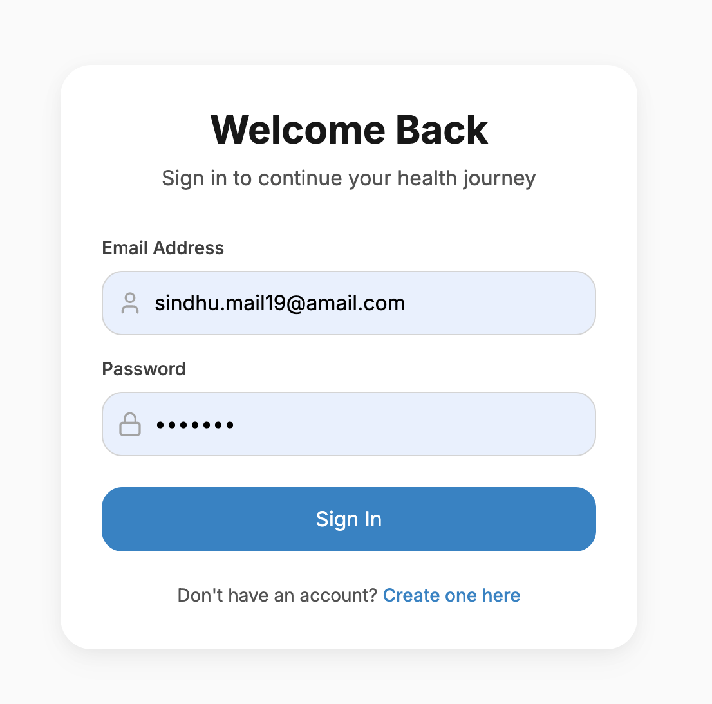
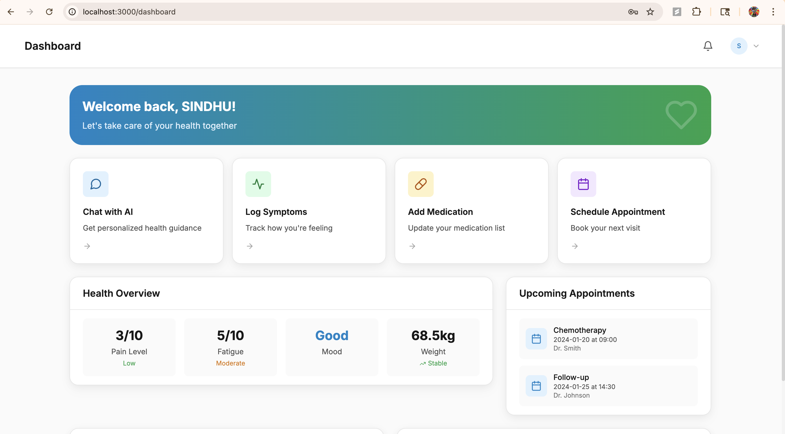
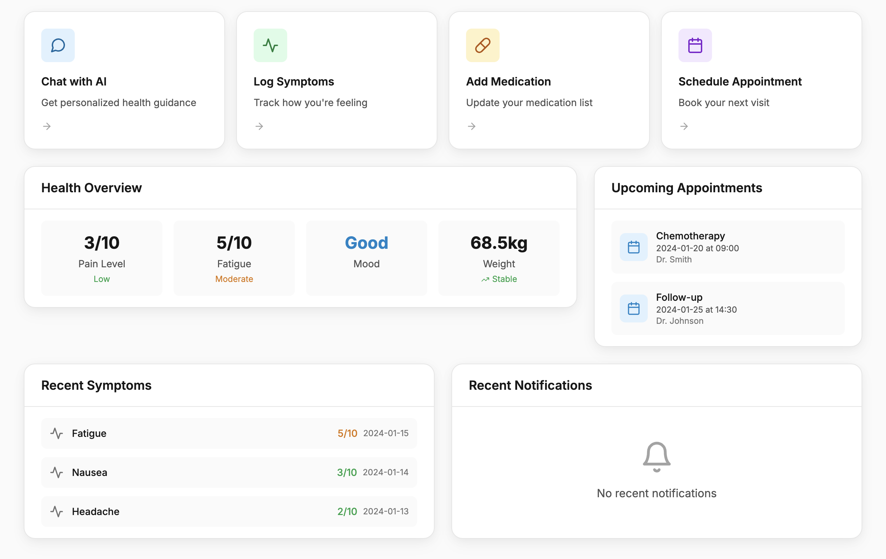
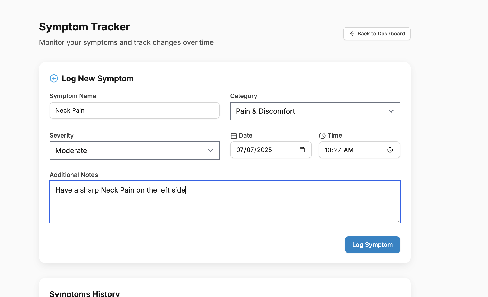
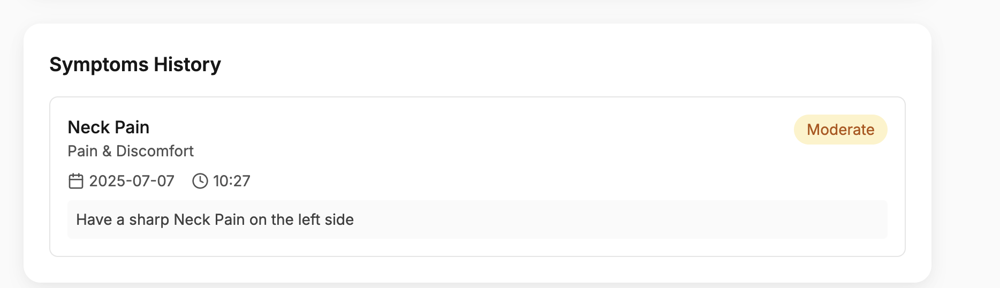
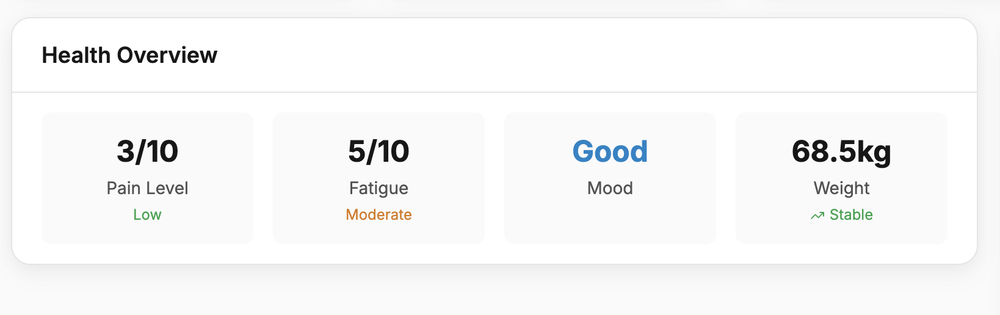
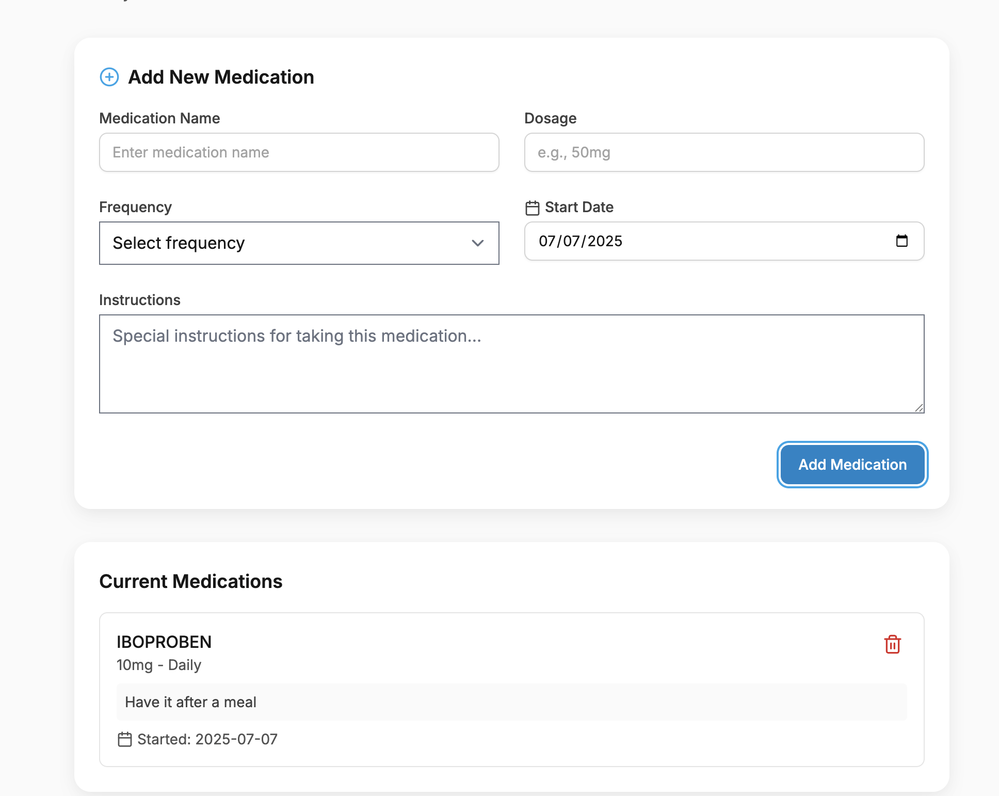
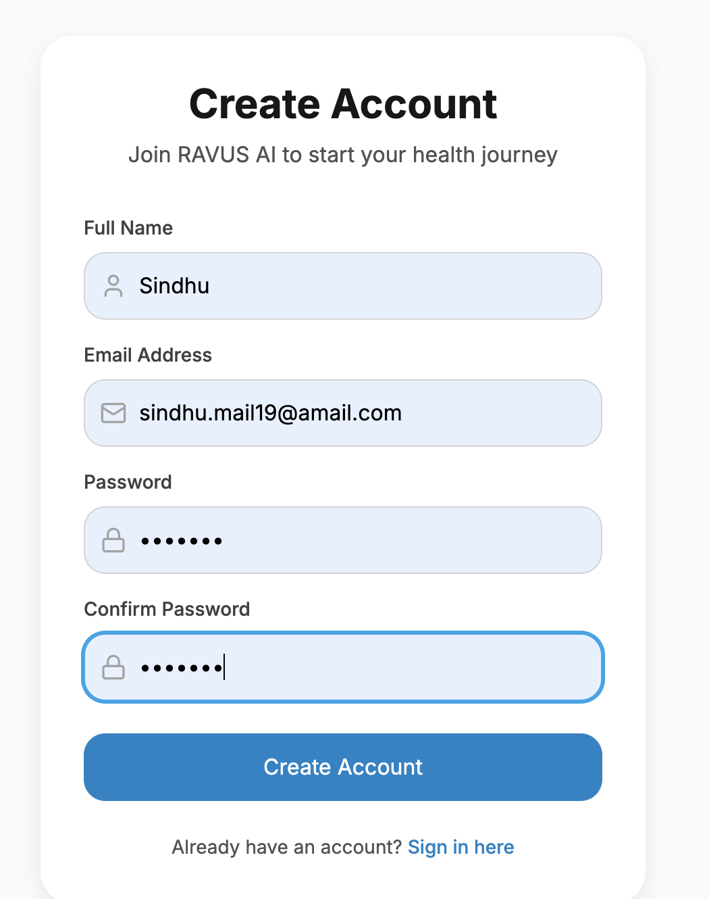

# RAVUS AI - Your Intelligent Health Assistant

<div align="center">
  <h3>AI-Powered Healthcare Support System</h3>
  <p>Empowering cancer patients with intelligent health monitoring and personalized care assistance</p>
</div>

## 📖 Table of Contents
- [Demo Video](#-demo-video)
- [User Authentication](#-user-authentication)
- [Features Overview](#-features-overview)
- [How It Works](#-how-it-works)
- [Technical Architecture](#-technical-architecture)
- [Installation Guide](#-installation-guide)
- [Usage Examples](#-usage-examples)
- [Security & Privacy](#-security--privacy)
- [Contributing](#-contributing)
- [License](#-license)

## 🎥 Demo Video

### Watch Our Demo on YouTube
<div align="center">
  <a href="https://youtu.be/2raj8vfQYPA">
    
  </a>
  <p><em>Click to watch the full demo video on YouTube</em></p>
</div>

## 🔐 User Authentication

### Secure Sign-In Process
<div align="center">
  
  <p><em>Clean and secure authentication interface</em></p>
</div>

Our authentication system prioritizes both security and user experience:

- **Simple Sign-In**: Clean interface for quick and easy access
- **Secure Authentication**: Industry-standard encryption for user credentials
- **Account Management**: Easy account creation and recovery options
- **Session Handling**: Secure token-based authentication system

### Security Features
- Password encryption using bcrypt
- JWT (JSON Web Token) for secure sessions
- Rate limiting to prevent brute force attacks
- Automatic session timeout for security
- Two-factor authentication support (optional)

## 🌟 Features Overview

### Dashboard & Health Overview
<div align="center">
  
  <p><em>Comprehensive health dashboard (variant 1)</em></p>
  
  <p><em>Comprehensive health dashboard (variant 2)</em></p>
</div>

#### Quick Actions
- **Chat with AI**: Get personalized health guidance instantly
- **Log Symptoms**: Track how you're feeling with easy symptom logging
- **Add Medication**: Update and manage your medication list
- **Schedule Appointment**: Book and manage your medical appointments

#### Health Metrics at a Glance
- **Pain Level Monitoring**: Track pain on a 1-10 scale
- **Fatigue Assessment**: Monitor energy levels and fatigue
- **Mood Tracking**: Keep track of emotional well-being
- **Weight Management**: Monitor weight changes over time

#### Smart Features
- **Recent Symptoms Log**: Chronological tracking of reported symptoms
- **Upcoming Appointments**: Clear overview of scheduled medical visits
- **Health Status**: Real-time health metrics with trend indicators
- **Notification Center**: Important alerts and reminders

#### Dynamic Updates
- **Real-time Data**: Live updates of health metrics
- **Trend Analysis**: Visual indicators for health patterns
- **Appointment Management**: Upcoming medical visits with doctor details
- **Symptom Severity**: Color-coded severity indicators for quick assessment

### AI Health Assistant
<div align="center">
  
  <p><em>AI Assistant - Chat Interface 1</em></p>
  
  <p><em>AI Assistant - Chat Interface 2</em></p>
  
  <p><em>AI Assistant - Chat Interface 3</em></p>
  
  <p><em>AI Assistant - Chat Interface 4</em></p>
</div>

- **24/7 Health Support**: Get immediate responses to health concerns
- **Personalized Guidance**: AI adapts to your specific cancer type and treatment
- **Emergency Detection**: Automatic identification of urgent situations
- **Treatment Information**: Comprehensive explanations of procedures and medications

### Symptom Tracking
<div align="center">
  
  <p><em>Symptom Tracking - View 1</em></p>
  
  <p><em>Symptom Tracking - View 2</em></p>
</div>

- **Real-time Logging**: Easy-to-use interface for recording symptoms
- **Pattern Recognition**: AI-powered analysis of symptom patterns
- **Severity Tracking**: Visual representation of symptom progression
- **Report Generation**: Shareable reports for healthcare providers

### Health Metrics Dashboard
<div align="center">
  
  <p><em>Comprehensive health data visualization</em></p>
</div>

- **Vital Statistics**: Track important health indicators
- **Treatment Progress**: Monitor therapy effectiveness
- **Medication Adherence**: Track medication schedules and compliance
- **Custom Metrics**: Personalized tracking of relevant health factors

### Medication Management
<div align="center">
  
  <p><em>Medication management interface</em></p>
</div>

## 🔄 How It Works

### 1. User Onboarding
<div align="center">
  
  <p><em>Simple and secure account creation and profile setup</em></p>
</div>

1. Create secure account
2. Complete health profile
3. Set up emergency contacts
4. Configure notification preferences

### 2. Daily Health Monitoring

1. Log daily symptoms
2. Record medication intake
3. Track side effects
4. Monitor vital signs

### 3. AI Analysis & Support
<div align="center">
</div>

1. Pattern recognition in symptoms
2. Predictive health alerts
3. Treatment effectiveness analysis
4. Personalized recommendations

## 🔧 Technical Architecture

### Tech Stack
- **Frontend**: 
  - React.js with TypeScript
  - TailwindCSS for styling
  - Framer Motion for animations
  - React Query for state management

- **Backend**:
  - Node.js with Express
  - PostgreSQL database
  - Redis for caching
  - JWT authentication

- **AI/ML**:
  - OpenAI GPT-4 for natural language processing
  - TensorFlow for health predictions
  - Custom ML models for symptom analysis


## 📦 Installation Guide

1. Clone the repository:
```bash
git clone https://github.com/yourusername/Health-AI-Agent.git
cd Health-AI-Agent
```

2. Install dependencies:
```bash
# Install frontend dependencies
cd client
npm install

# Install backend dependencies
cd ../server
npm install
```

3. Set up environment variables:
```bash
# Server Configuration
PORT="PORT_NO"
NODE_ENV=development

# MongoDB Configuration
MONGODB_URI="MONGO_DB_URI_HERE"
# OpenAI Configuration (optional - will use fallback responses if not set)
GOOGLE_API_KEY="GOOGLE_API_KEY_HERE"

```